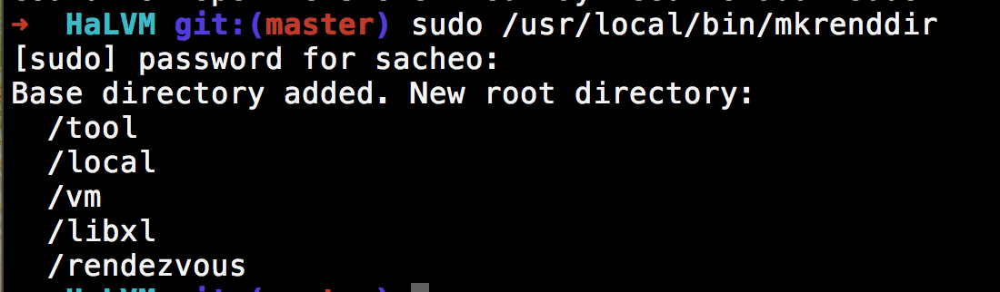

# Technical Report -- HaLVM

## The Overview

HaLVM is a virtual machine written mainly in Haskell. It can run on Linux and Xen hypervisor. Compared with House, it is more widely used as a commercial product (by Galois Inc.) rather than a research project. And it is open sourced and maintained on GitHub.

> The Haskell Lightweight Virtual Machine, or HaLVM, is a port of the Glasgow Haskell Compiler tool-suite to enable developers to write high-level, lightweight virtual machines that can run directly on the Xen hypervisor.

## Background Knowledge
### The terminologies in Hypervisor-based VM
* Hypervisor: A hypervisor or virtual machine monitor (VMM) is a piece of computer software, firmware or hardware that creates and runs virtual machines.
* Hypercall: A hypercall is to a syscall what a hypervisor is to an OS.
* Domain: a domain is one of the virtual machines that run on the system.
* IVC: Inter VM communication.
* Paravirtualization: A virtualization technique that presents a software interface to virtual machines that is similar, but not identical to that of the underlying hardware.

## Code Analysis

### General Code structure:

1. GHC 7.8.4 (The newest currently)
2. HaLVM Source
	* bootloader: Architecture specific (x86_64, i386) assembly code used to boot up the VM in Xen.
	* HaLVM Core:
		- cbits: Xen related, written in C, including IO, domain setup, system information setup and gchi stub functions.
		- Communication: Support for inter-domain communication through typed communication channels, and routines for automatically performing rendezvous between two domains.
		- Hypervisor: Hypercalls, Hardware Structure information, and interfaces such as IO, Memory, Port, Console Control, Domain Information
	* IVC Library: This directory defines a C API for interacting with HaLVM domains via the
standard IVC mechanisms.
	* XenDevice: provides access to the Xen paravirtualized devices

### Makefile -- baby step
The main `Makefile` of HaLVM has over 400 lines. So, I will only give a rough investigation into it.

#### File Downloads
Download components not included in the source from Internet, including:

* GHC (The tool suite including RTS)
* Cabal (The Package Manager)

#### Platform GHC Preparation
the next five components are prepared:

* CABAL
* ALEX: A tool for generating lexical analyzers in Haskell
* HAPPY: The Parser Generator for Haskell
* HADDOCK: Command-line program documentation generator for Haskell
* HSCOLOUR: Colorize Haskell code

#### Prepping / supporting the GHC build
Mostly do symbolic linking and `git clone` etc.

Here is an overview:

	GHC_PREPPED = $(TOPDIR)/halvm-ghc/libraries/base/GHC/Event/NoIO.hs \
	              $(TOPDIR)/halvm-ghc/rts/xen/include/xen              \
	              $(TOPDIR)/halvm-ghc/libraries/base/ghc.mk            \
	              $(TOPDIR)/halvm-ghc/libraries/base/libc-include      \
	              $(TOPDIR)/halvm-ghc/mk/build.mk                      \
	              $(TOPDIR)/halvm-ghc/libraries/HALVMCore              \
	              $(TOPDIR)/halvm-ghc/libraries/XenDevice

#### GMP, LibM
GMP is the GNU Multiple Precision Arithmetic Library, which is part of the RTS supporting library.

LibM is the GNU Math Lib.

#### `MK\_REND\_DIR`
"REND" is a strange. Due to the lack of documentation, I have to guess its meaning from the source code.

It is a separatedly compiled code with only a `main`, doing some `mkdir` or asking for permissions. So it could be used to setup the base environment for the `Xen` in fedora host to run.

#### Bootloader
This section compiled the assembly code with some header files, producing a `start.o` object file, which will be linked to the kernel image later.

#### HaLVM
First, four binaries is compiled, the later three are all for RTS:

* `ghc-stage1`
* `libHSrts.a`
* `libHSrts_thr.aa`
* `libHSrts_p.a`

Then, in `install` (which could be triggered by `make install`), it compiled the `minilibc` support for `HaLVM` and `GHCi`.

Then, a long list of `$(INSTALL)` including: cabal, config, ghc, pkg, ldkernel, lds, cabal, hsc2hs, alex, happy, haddock

### Linker -- The difficult job
I investigated into the `./misc/kernel-i386.lds` which will be invoked by `ldkernel.in` in `scripts`.

The reason why this part is difficult is, we have to decide how to make the separately compiled C code, assembly code, Haskell code, RTS code, `libc` code into a organic system.

The main concerns could be:

* How will the image layout be like?
* Where to put the bootloader?
* Is there some measurement to ensure that the foreign calls will work? (calling convention)
* How will it be related to the underlying hardware?

Finally, this is how to do the actually linking:

	LDCMD="ld ${LINKER_SCRIPT} -nostdlib ${START_FILE} $ARGS $LIBS $LIBS ${GMP_FILE} ${LIBM_FILE}"

in which the `START_FILE` is the bootloader, the `LIBS` is the `halvmlibdir`, i.e. the RTS, `minilibc` etc.

## Comparison with House

### About Xen

The major difference origins from the underlying base, which is just the bare metal for House, and the Xen hypervisor for HaLVM.

To put your OS into production, using Xen would be a good idea, since you don't have to interface with all kinds of architecture details and various hardwares. But there is also **some deficiencies**.

* First, although Xen is already slim enough, it is still another layer of logic, which might effect the speed performance. And Xen might also be a so-called "attack surface", i.e., some widely used system which might have unknown bugs and security holes.
* Second, additional learning cost. Learn to deploy and use a hypervisor is actually needing some considerable efforts. The ideas such as "Dom0", "IVC", "XenDevice", "Hypercall" all need us to learn it. But it is also rewarding and useful, since many major cloud service provider is building their IaaS on a Xen hypervisor, for example, the Amazon EC2 Cloud.

But as far as I considered, using a hypervisor as underlying hardware is *still much better* from the perspective of deployment and production. Although this would require us to include much more unverified codebase.

### About Maintainance

And more importantly, HaLVM is such an unmature but actively maintained project, so this might be a good entry point of our project. Currently, it is integrated with HaNS (the network stack project also by the Galois Inc.) so it could be used as a web server.

But it is **LACKING** any kind of development documentation, and unverified. As far as I know, recently a project called "EsseOS" is also built on top the HaLVM, but "EsseOS" is described in a poorly cited paper and not open sourced.

## Config & Running
### Compilation and Deployment
Compilation of source, deploy Xen Hypervisor Environment in Fedora Linux are included in the build note.

For the sake of simplicity, I will not include it here. You might find it in the `note.pdf` file

### Code Statistics
* In C Language: 336 files
* In Haskell Languge: 31 files

### Running:
I have tested several `Core` test cases distributed with the code. Many have failed, and I suppose it is because I don't configure in a best wat. I will ask this problem on the mail list.

* Failed Cases: ClientRendezvous Hello DomainInfo PeerRendezvous LoopThreads ExitTest MVarTest SimplerTime Null
* Half Succeeded: Xenstore GetIdTest
* Succeeded: Time 

Two main debugging information for failures:

#### Unknown Domain Identifier

	sudo xl destroy GetId
	GetId is an invalid domain identifier (rc=-6)
	Makefile:12: recipe for target 'run' failed
	make: [run] Error 2 (ignored)

#### `demsg -c` is invalid

	sudo xl create Null.config
	Parsing config from Null.config
	sleep 1
	sudo xl dmesg -c

#### Possible Solution
`prefix` it (since I can't REALLY find the directories)

### Details & Screenshots

#### Source tree of HaLVM

#### All Code in Haskell

#### The effect of `mkrenddir`:

#### The deployed Xen utils:

### The examples:

#### `GetID`

#### `Time`

#### `Xenstore`

## HaNS
HaNS is the network stack designed to integrate with HaLVM. Interestingly, it is not bundled with HaLVM together. The truth is that, *You may install it seperately if you want to build something like a webserver*. While the HaLVM is using a composable, independent architecture, the House project is using a built-in `Net` module as a hard-wired one.

From the source files we can see that, HaNS and House Net don't have too much difference in functionality, but differs on *coupling extent*. The HaNS is well structured, clearly interfaced, so it would be easier to migrate to other usage.

